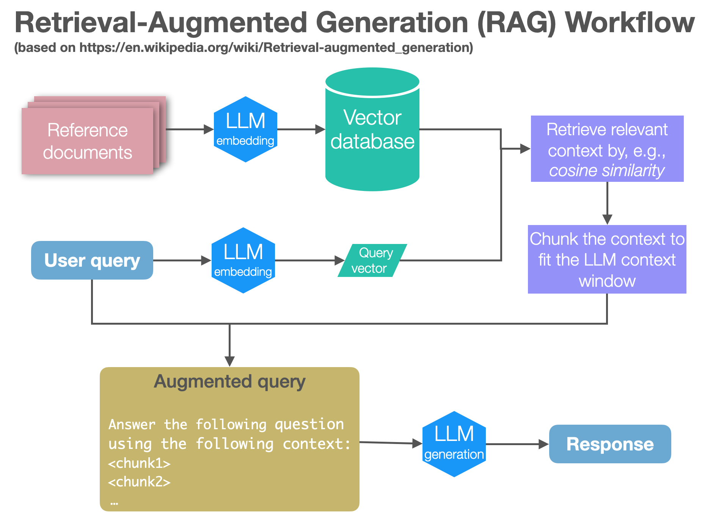

# Introduction

The following is a simple demonstration of RAG (Retrieval-Augmented Generation) using the events of 2023 to show how to extend `gpt-3.5-turbo-instruct`. The attached notebook, `rag_notebook.ipynb`, contains the code and some explanations of the method along with the accompanying code.

- You will need access to the OpenAI API.
- Use `requirements.txt` for the list of packages used.
- The notebook is formatted by the black formatter (`-l 120`).
